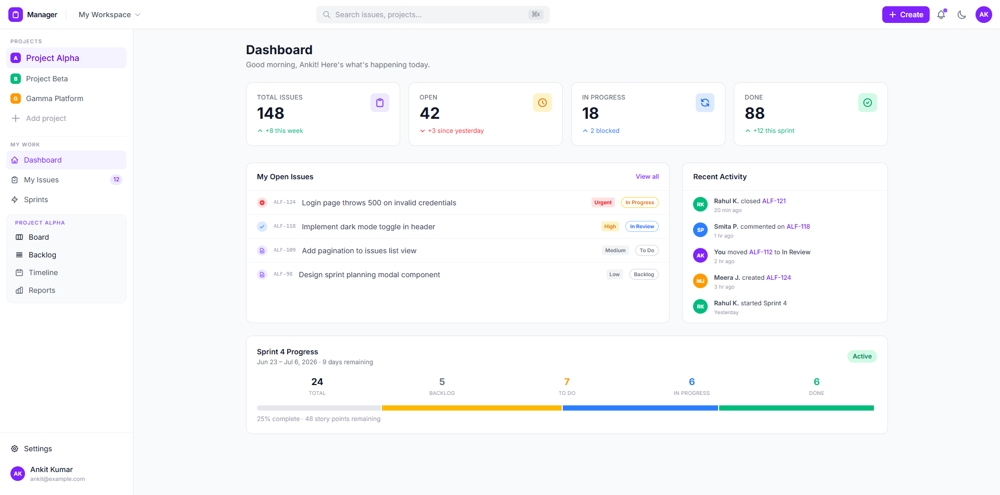
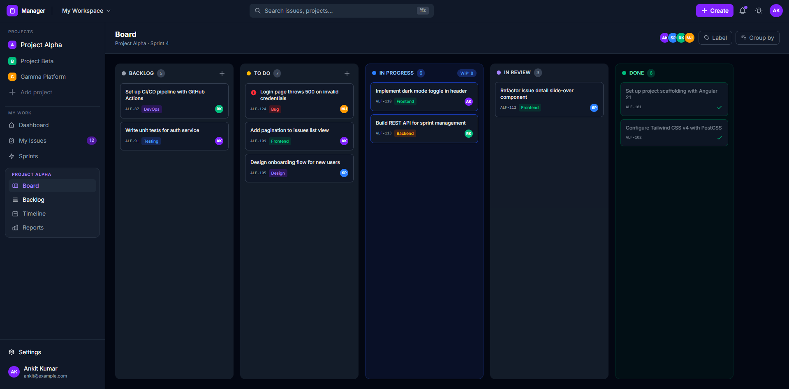

# TaskPad

> An agile project management and issue-tracking web application inspired by Atlassian Jira, built for modern product and engineering teams.

---

## Overview

**TaskPad** enables teams to plan, track, and manage software projects with speed and clarity. From backlog refinement to Kanban and Scrum sprint boards, TaskPad simplifies workflows across organizations.

### Key Capabilities

- **Interactive Kanban & Scrum Boards**: Drag-and-drop issue cards across customizable columns (To Do, In Progress, In Review, Done).
- **Issue Tracking**: Create and manage Epics, Stories, Tasks, and Bugs with tags, priorities, estimates, and assignees.
- **Backlog & Sprint Planning**: Plan active sprints, estimate story points, and prioritize user stories.
- **Team Collaboration**: Assign team members, track status transitions, and organize project milestones.

---

## UI Previews

### Homepage / Dashboard Preview


### Kanban Board Preview


---

## Tech Stack

- **Framework**: React 19 + TypeScript
- **Bundler & Build Tool**: Vite
- **Styling**: Tailwind CSS
- **Linting & Code Quality**: ESLint + TypeScript-ESLint

---

## Getting Started

### Prerequisites

- **Node.js**: `^20.0` or higher
- **npm**: `^10.0` or higher
- **Backend API**: Running instance of [TaskPad API](../taskpad-api/README.md) (default: `http://localhost:8000`)

### Installation & Development

```bash
cd taskpad

# Install dependencies
npm install

# Start Vite dev server
npm run dev
```

The frontend development server runs at `http://localhost:5173`.

### Production Build

```bash
# Type check and production bundle
npm run build

# Preview production build locally
npm run preview
```

---

## Project Structure

```text
taskpad/
├── docs/
│   └── images/               # UI design mockups and documentation assets
├── public/                   # Static public assets
├── src/
│   ├── assets/               # Local icons and SVGs
│   ├── components/           # Reusable UI elements (Navbar, Cards, Modals)
│   ├── pages/                # Application routes and views (Login, Register, Board)
│   ├── App.tsx               # Root component & routing
│   ├── main.tsx              # Application entry point
│   └── index.css             # Tailwind and global stylesheet
├── index.html
├── package.json
├── tsconfig.json
└── vite.config.ts
```

---

## Related Repositories

- [TaskPad Backend API](../taskpad-api/README.md) — Laravel 12 REST API with Swagger / OpenAPI support.
